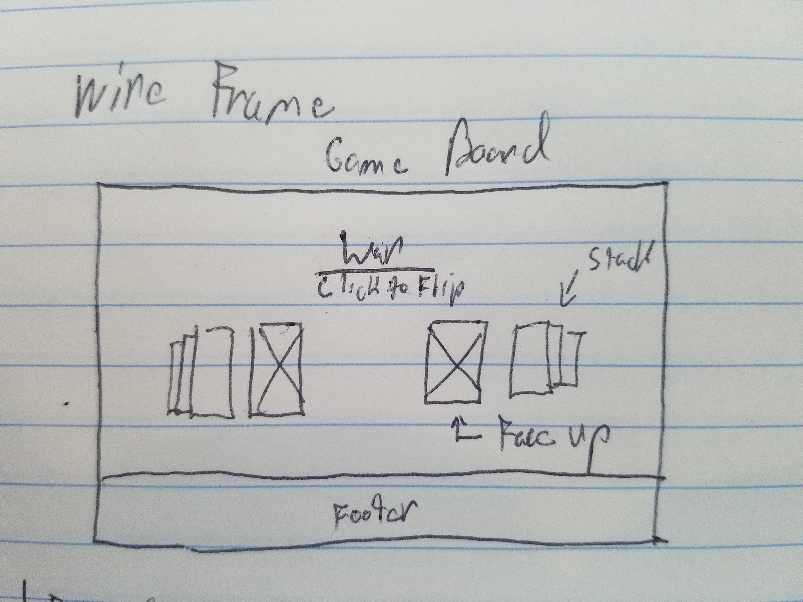

# 

# this is the Readme

#[link to trello](https://trello.com/b/QzFF5Bav/war)

## Concept: 
I wanted to recreate the card game "war" but make it more fun than just playing with regular playing cards.  My original idea involved using images like horses as the face of the cards, but then I discovered the pachimon card, and they HAD to be the focal point of my project.

I wanted to ensure that my minimum deliverable project was something that I could actually build before the deadline, in order to give my self time to style and animate my game, and make it funny.

I found that it was very difficult to hold back on the styling and funniness, so I ended up styling, working on the concept, and building the logic all at the same time.  

## Building the logic was by far the most challenging part, 

but once I got cards to show on the page, I felt empowered, and I knew I was going to be able to finish my project which was very rewarding.

The parts of the logic that I am most proud of are being able to randomize the card appearance, figuring out how to reset css animations using a setTimeout function, and this line...

$('#rightCardFace').css("background-image",'url(' +flippedRightRando.location+ ')'); 

...Where I use J query to append the card to an html container, and then by storing the card's url as a variable, concatenating it into the right part of the a css declaration.  

This was signifcant to me becuase I realized I can now take any css property, or html element, with anything I want inside of them, and put them on the page with variables inside of them, and that be changed and updated at anytime with javaScript.  

I am very proud that I was able to complete this assignment, and after our cohort ends I plan on coming back to this game and fufilling all of my stretch goals, which are really just alot more css animations.

